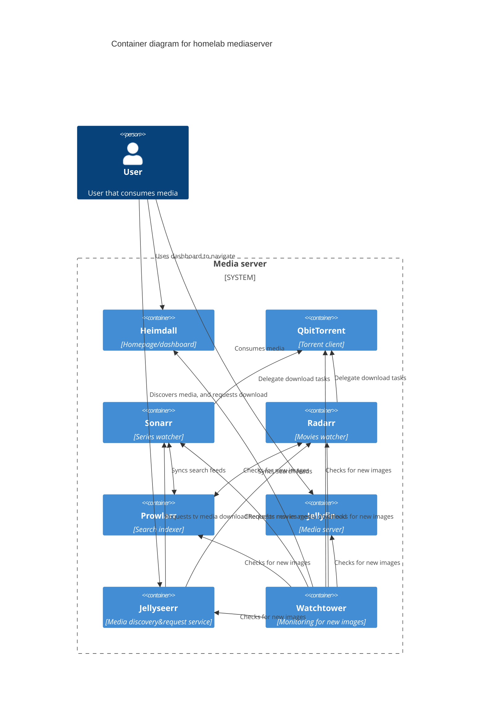

# Homelab

Config for media server



## Crontab example

```sh
@reboot /home/user/start.sh

```

## Sonarr, Radarr, Jellyfin, Prowlarr

Please note for nginx to work you first need to setup basepath in each service separately, after that you can remove open port from them.

## Jellyseerr

Currently jellyseerr don't support baseurl setting (next js have some issue with that)
so it will have open port ;(
