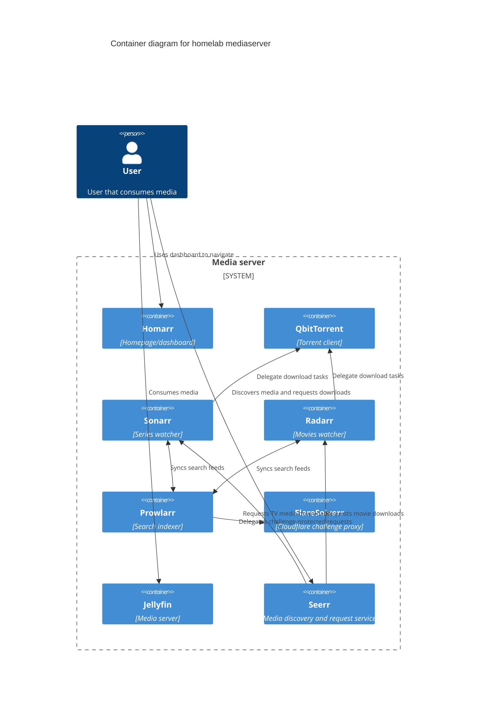

# Homelab

Config for media server


```mermaid
    C4Container
    title Container diagram for homelab mediaserver

    Person(user, User, "User that consumes media")
    System_Boundary(homelab, "Media server") {
        Container(homarr, "Homarr", "Homepage/dashboard")
        Container(qbit, "QbitTorrent", "Torrent client")
        Container(sonarr, "Sonarr", "Series watcher")
        Container(radarr, "Radarr", "Movies watcher")
        Container(prowlarr, "Prowlarr", "Search indexer")
        Container(flaresolverr, "FlareSolverr", "Cloudflare challenge proxy")
        Container(jellyfin, "Jellyfin", "Media server")
        Container(seerr, "Seerr", "Media discovery and request service")
    }
    Rel(user, homarr, "Uses dashboard to navigate")
    BiRel(prowlarr, sonarr, "Syncs search feeds")
    BiRel(prowlarr, radarr, "Syncs search feeds")
    Rel(prowlarr, flaresolverr, "Delegates challenge-protected requests")
    Rel(sonarr, qbit, "Delegate download tasks")
    Rel(radarr, qbit, "Delegate download tasks")
    Rel(user, jellyfin, "Consumes media")
    Rel(user, seerr, "Discovers media and requests downloads")
    Rel(seerr, sonarr, "Requests TV media downloads")
    Rel(seerr, radarr, "Requests movie downloads")
    UpdateLayoutConfig($c4ShapeInRow="3", $c4BoundaryInRow="1")
```

## Crontab example

```sh
@reboot /home/user/start.sh

```

## Homarr

Homarr is available at Caddy's root URL and is configured from its web UI.
Dashboard state and encrypted integration credentials persist under
`conf/homarr/`, which is excluded from Git.

Generate the required encryption key once and keep it stable in `.env`:

```sh
printf 'HOMARR_SECRET_ENCRYPTION_KEY=%s\n' "$(openssl rand -hex 32)" >> .env
```

Configure links and integrations for Sonarr, Radarr, Prowlarr, Jellyfin,
qBittorrent, and Seerr through Homarr's dashboard editor. Back up
`conf/homarr/` because it contains the dashboard database and configuration.

## Sonarr, Radarr, Jellyfin, Prowlarr

These services must keep their configured URL base paths for Caddy's path-based
routes to work. After verifying the proxy routes, their direct host ports can be
removed if they are not needed for administration.

## FlareSolverr

FlareSolverr is available only to other containers at
`http://flaresolverr:8191`; it does not need a host port or a Caddy route.
Configure it in Prowlarr:

1. Start the services with `docker compose up -d flaresolverr prowlarr`.
2. In **Prowlarr > Settings > Indexers > Indexer Proxies**, add a
   **FlareSolverr** proxy whose host is `http://flaresolverr:8191`.
3. Give the proxy a tag such as `flaresolverr`, then add the same tag only to
   indexers that need Cloudflare challenge handling.
4. Test and save both the proxy and each tagged indexer.

Sonarr and Radarr need no FlareSolverr configuration: they receive Prowlarr's
already-resolved indexer results. FlareSolverr cannot solve CAPTCHAs, and a
Cloudflare update may temporarily break it; use only indexers you are authorized
to access.

## Seerr

Seerr remains exposed on port `5055` because it is not configured with a base
path. Configure its browser-accessible port `5055` URL in Homarr.
