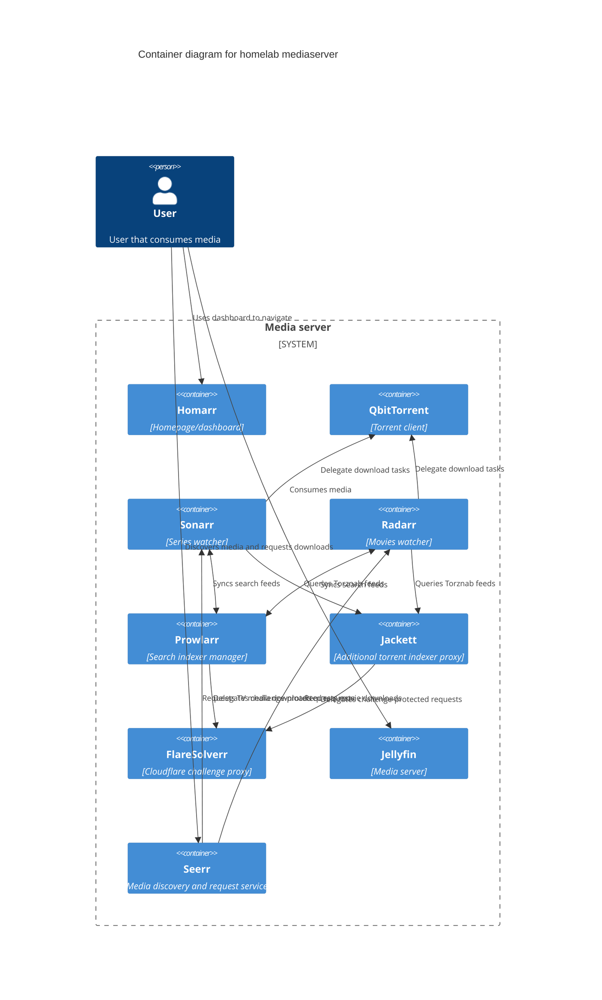

# Homelab

Config for media server


```mermaid
    C4Container
    title Container diagram for homelab mediaserver

    Person(user, User, "User that consumes media")
    System_Boundary(homelab, "Media server") {
        Container(homarr, "Homarr", "Homepage/dashboard")
        Container(qbit, "QbitTorrent", "Torrent client")
        Container(sonarr, "Sonarr", "Series watcher")
        Container(radarr, "Radarr", "Movies watcher")
        Container(prowlarr, "Prowlarr", "Search indexer manager")
        Container(jackett, "Jackett", "Additional torrent indexer proxy")
        Container(flaresolverr, "FlareSolverr", "Cloudflare challenge proxy")
        Container(jellyfin, "Jellyfin", "Media server")
        Container(seerr, "Seerr", "Media discovery and request service")
    }
    Rel(user, homarr, "Uses dashboard to navigate")
    BiRel(prowlarr, sonarr, "Syncs search feeds")
    BiRel(prowlarr, radarr, "Syncs search feeds")
    Rel(sonarr, jackett, "Queries Torznab feeds")
    Rel(radarr, jackett, "Queries Torznab feeds")
    Rel(prowlarr, flaresolverr, "Delegates challenge-protected requests")
    Rel(jackett, flaresolverr, "Delegates challenge-protected requests")
    Rel(sonarr, qbit, "Delegate download tasks")
    Rel(radarr, qbit, "Delegate download tasks")
    Rel(user, jellyfin, "Consumes media")
    Rel(user, seerr, "Discovers media and requests downloads")
    Rel(seerr, sonarr, "Requests TV media downloads")
    Rel(seerr, radarr, "Requests movie downloads")
    UpdateLayoutConfig($c4ShapeInRow="3", $c4BoundaryInRow="1")
```

## Complete first-time setup

Follow these steps in order. In the examples below, `<host>` is the Docker
host's LAN IP address or DNS name. Use Docker service names for communication
between containers; `localhost` inside a container refers to that container,
not the Docker host.

The intended request flow is:

```text
Seerr -> Sonarr/Radarr -> qBittorrent -> imported media -> Jellyfin
                    |
                    +-> Prowlarr and Jackett (indexer queries)
```

### 1. Prepare the host

Docker Engine with the Compose plugin is required. The command examples assume
a Linux host with `sudo`, `openssl`, `tar`, and standard POSIX shell tools. Run
`id` as the account that should own the media files. The compose file currently
uses UID/GID `1000`;
change every `PUID`/`PGID` value before startup if the reported IDs differ.
Confirm that `/mnt/media` is the intended mounted filesystem before creating
anything there.

```sh
APP_UID="$(id -u)"
APP_GID="$(id -g)"
printf 'Using UID=%s GID=%s\n' "$APP_UID" "$APP_GID"
sudo mkdir -p /mnt/media/downloads /mnt/media/tv /mnt/media/movies
```

For new or empty directories created for this stack, set their ownership without
recursively changing an existing media library:

```sh
sudo chown "$APP_UID:$APP_GID" \
  /mnt/media/downloads /mnt/media/tv /mnt/media/movies
```

These host paths are mounted consistently into the applications:

| Purpose | Host path | Container path |
| --- | --- | --- |
| Downloads | `/mnt/media/downloads` | `/downloads` in qBittorrent, Sonarr, and Radarr |
| TV library | `/mnt/media/tv` | `/tv` in Sonarr; `/data/tvshows` in Jellyfin |
| Movie library | `/mnt/media/movies` | `/movies` in Radarr; `/data/movies` in Jellyfin |

Because qBittorrent and the Arr applications all see downloads as `/downloads`,
no remote path mapping should be necessary.

### 2. Create the environment file and start the stack

For a fresh installation, create `.env`, generate a stable Homarr encryption
key, and paste the generated value after `HOMARR_SECRET_ENCRYPTION_KEY=`:

```sh
cp .env.example .env
openssl rand -hex 32
# Open .env in your preferred editor and paste the generated value.
chmod 600 .env
```

Never rotate this key without following Homarr's migration procedure, or its
stored credentials will become unreadable.

For an existing installation, do **not** replace `.env` or regenerate any API
keys. Stop the services and make a consistent backup before pulling images that
may run database migrations:

```sh
docker compose stop
backup_dir="../homelab-backup-$(date +%Y%m%d-%H%M%S)"
mkdir -p "$backup_dir"
cp -p .env "$backup_dir/"
tar -czf "$backup_dir/conf.tar.gz" conf
```

Before startup, restrict published ports to trusted LAN clients with the host
firewall. The stack exposes plain HTTP and several unauthenticated or
administrator-level APIs; it is not safe to expose directly to the internet.
Then start or upgrade it:

```sh
docker compose pull
docker compose up -d
docker compose ps
```

### 3. Configure URL bases and administrator accounts

Configure Sonarr, Radarr, and Prowlarr first through their initially published
ports. Complete each application's authentication prompt, choose Forms or Basic
authentication, require authentication, and set a strong administrator
password. Set the URL base under **Settings > General** before relying on Caddy.
The later service steps cover the qBittorrent, Jackett, Jellyfin, Seerr, and
Homarr first-run screens.

| Service | Initial direct URL | URL base | Normal browser URL |
| --- | --- | --- | --- |
| Homarr | `http://<host>/` | none | `http://<host>/` |
| qBittorrent | `http://<host>:8080` | none | `http://<host>/qbt/` |
| Prowlarr | `http://<host>:9696` | `/prowlarr` | `http://<host>/prowlarr` |
| Sonarr | `http://<host>:8989` | `/sonarr` | `http://<host>/sonarr` |
| Radarr | `http://<host>:7878` | `/radarr` | `http://<host>/radarr` |
| Jellyfin | `http://<host>:8096` | `/jellyfin` | `http://<host>/jellyfin` |
| Jackett | `http://<host>:9117` | none | `http://<host>:9117` |
| Seerr | `http://<host>:5055` | none | `http://<host>:5055` |
| FlareSolverr | `http://<host>:8191` | none | API endpoint only |

After setting the URL bases, restart the affected containers:

```sh
docker compose restart prowlarr sonarr radarr
```

The matching Docker-network URLs used by integrations are:

```text
Prowlarr:    http://prowlarr:9696/prowlarr
Sonarr:      http://sonarr:8989/sonarr
Radarr:      http://radarr:7878/radarr
Jellyfin:    http://jellyfin:8096/jellyfin
qBittorrent: http://qbittorrent:8080
Jackett:     http://jackett:9117
Seerr:       http://seerr:5055
FlareSolverr: http://flaresolverr:8191
```

### 4. Credential and API key reference

Collect each credential as its service is configured in the later steps. Most
API keys are generated automatically rather than created manually. Store them
in a password manager and never commit them to Git.

| Service | Where to obtain the credential | Used by |
| --- | --- | --- |
| Sonarr | **Settings > General > Security > API Key** | Prowlarr, Seerr, Homarr |
| Radarr | **Settings > General > Security > API Key** | Prowlarr, Seerr, Homarr |
| Prowlarr | **Settings > General > Security > API Key** | Homarr and API clients |
| Jackett | API key displayed at the top of its dashboard | Sonarr and Radarr Torznab entries |
| Jellyfin | **Dashboard > API Keys > Add**; create a named key for Homarr | Homarr |
| Seerr | **Settings > General > API Key** | Homarr or other API clients |
| qBittorrent | Web UI username and password; it has no API key | Sonarr, Radarr, optionally Prowlarr |
| FlareSolverr | No built-in credential; keep port `8191` firewall-restricted | Prowlarr and Jackett |

Sonarr, Radarr, Prowlarr, Jackett, and Seerr use one global API key each. If one
is regenerated, update every consumer listed above. Jellyfin supports multiple
named API keys, so create a separate key per integration when practical.

### 5. Configure qBittorrent

On a fresh LinuxServer qBittorrent installation, the username is `admin` and a
temporary password is printed to the container logs. Retrieve it, sign in, and
immediately configure a permanent username/password under
**Tools > Options > Web UI > Authentication**.

```sh
docker compose logs qbittorrent | grep -i "temporary password"
```

Under **Tools > Options > Downloads**:

1. Set the default save path to `/downloads`.
2. If an incomplete-download directory is enabled, keep it below `/downloads`,
   for example `/downloads/incomplete`.

In the transfer list's **Categories** panel, create categories `tv` and
`movies`. Optional category-specific save paths are `/downloads/tv` and
`/downloads/movies`. Test that adding and deleting a small authorized download
works before connecting Sonarr or Radarr.

### 6. Configure Sonarr and Radarr

In **Settings > Media Management > Root Folders**, add:

| Application | Root folder | Download category |
| --- | --- | --- |
| Sonarr | `/tv` | `tv` |
| Radarr | `/movies` | `movies` |

Select the desired naming and quality profiles. Keep completed-download handling
enabled so each application imports completed files from `/downloads` into its
library.

In each application, open **Settings > Download Clients**, add
**qBittorrent**, and use:

| Field | Value |
| --- | --- |
| Host | `qbittorrent` |
| Port | `8080` |
| Use SSL | disabled |
| URL Base | empty |
| Username/password | the permanent qBittorrent Web UI credentials |
| Category | `tv` in Sonarr; `movies` in Radarr |

Test and save both clients. Do not add a remote path mapping unless the mount
layout is changed and the applications no longer see the same `/downloads`
path.

### 7. Configure Prowlarr indexers and application sync

1. In **Prowlarr > Indexers**, add and test only trackers that you are
   authorized to access.
2. If an indexer needs Cloudflare challenge handling, open
   **Settings > Indexers > Indexer Proxies**, add a **FlareSolverr** proxy with
   host `http://flaresolverr:8191`, and give it a tag such as `flaresolverr`.
   Add the same tag only to indexers that need the proxy, then test both the
   proxy and each tagged indexer.
3. Open **Settings > Apps** and add Sonarr with:
   - **Prowlarr Server:** `http://prowlarr:9696/prowlarr`
   - **Sonarr Server:** `http://sonarr:8989/sonarr`
   - **API Key:** the Sonarr API key
   - **Sync Level:** `Add and Remove Only` is a safe default when Jackett feeds
     will also be managed directly in Sonarr.
4. Add Radarr with the same Prowlarr Server value and:
   - **Radarr Server:** `http://radarr:7878/radarr`
   - **API Key:** the Radarr API key
5. Test and save both applications, then run **Sync App Indexers**.
6. Confirm the Prowlarr-managed entries appear under
   **Sonarr/Radarr > Settings > Indexers** and that RSS, automatic search, and
   interactive search are enabled as intended.

The URL bases are required in all three server URLs. Omitting them creates
broken Torznab URLs or failed application synchronization. FlareSolverr cannot
solve CAPTCHAs, and Cloudflare changes may temporarily break it.

Adding qBittorrent under **Prowlarr > Settings > Download Clients** is optional;
it is only needed to grab a result directly from Prowlarr's own search UI.
Sonarr and Radarr still require their own download-client entries from step 6.

### 8. Configure Jackett as the additional indexer source

1. Open `http://<host>:9117`, set an administrator password, and record the API
   key shown on the dashboard.
2. Add and test each authorized tracker in Jackett.
3. If a tracker needs FlareSolverr, set Jackett's global
   **FlareSolverr API URL** to `http://flaresolverr:8191` and retest it.
4. Copy each tracker's individual **Torznab Feed** URL. Do not use the aggregate
   `all` feed.
5. In **Sonarr/Radarr > Settings > Indexers**, add **Torznab > Custom** using:
   - **URL:**
     `http://jackett:9117/api/v2.0/indexers/<indexer-id>/results/torznab/`
   - **API Path:** `/api`
   - **API Key:** the Jackett API key
   - **Categories:** TV categories in Sonarr and movie categories in Radarr
6. Enable RSS, automatic search, and interactive search, then test and save.

Configure each tracker through either Prowlarr or Jackett, not both, unless the
duplicate traffic is intentional. Querying the same tracker twice wastes API
limits and can trigger temporary bans.

### 9. Configure Jellyfin and media clients

1. Complete Jellyfin's first-run wizard and create an administrator account.
2. Set its URL base to `/jellyfin` and restart Jellyfin.
3. Under **Dashboard > Libraries**, create:
   - a Movies library using `/data/movies`;
   - a Shows library using `/data/tvshows`.
4. Run an initial library scan.
5. Under **Dashboard > API Keys**, create a named API key for Homarr.
6. Create normal, non-administrator users for playback where appropriate.

Jellyfin TV, mobile, and desktop clients should connect to
`http://<host>/jellyfin` and authenticate with a Jellyfin user. Jellyfin does
not connect directly to Sonarr or Radarr; it sees imported media through the
shared host library directories.

### 10. Configure Seerr requests

Open `http://<host>:5055` and complete the setup wizard using a Jellyfin
administrator account.

For Jellyfin, use:

- **Internal URL:** `http://jellyfin:8096/jellyfin`
- **External URL:** `http://<host>/jellyfin`

Sync the Movies and Shows libraries and run the first manual library scan. Then
open **Seerr > Settings > Services** and add both Arr services:

| Field | Sonarr | Radarr |
| --- | --- | --- |
| Hostname | `sonarr` | `radarr` |
| Port | `8989` | `7878` |
| Use SSL | disabled | disabled |
| URL Base | `/sonarr` | `/radarr` |
| API Key | Sonarr API key | Radarr API key |
| Root Folder | `/tv` | `/movies` |
| External URL | `http://<host>/sonarr` | `http://<host>/radarr` |

Select a quality profile, mark each service as the default, enable scanning, and
optionally enable automatic search so approved requests are searched
immediately. Under **Settings > General**, set Seerr's application URL to
`http://<host>:5055` and record its generated API key if Homarr will use it.

### 11. Configure Homarr

Open `http://<host>/`, create the Homarr administrator account, and add dashboard
apps. Use browser-accessible URLs for tile links and Docker-network URLs for
server-side integrations:

| App | External/link URL | Internal/integration URL | Credential |
| --- | --- | --- | --- |
| qBittorrent | `http://<host>/qbt/` | `http://qbittorrent:8080` | Web UI username/password |
| Prowlarr | `http://<host>/prowlarr` | `http://prowlarr:9696/prowlarr` | Prowlarr API key |
| Sonarr | `http://<host>/sonarr` | `http://sonarr:8989/sonarr` | Sonarr API key |
| Radarr | `http://<host>/radarr` | `http://radarr:7878/radarr` | Radarr API key |
| Jellyfin | `http://<host>/jellyfin` | `http://jellyfin:8096/jellyfin` | Named Jellyfin API key |
| Seerr | `http://<host>:5055` | `http://seerr:5055` | Seerr API key |
| Jackett | `http://<host>:9117` | `http://jackett:9117` | Link only if no native integration is offered |

Field names vary between Homarr integrations. If an integration offers only one
URL, use the internal URL for API-backed widgets and configure the external URL
on the associated app tile. Back up `.env` together with `conf/homarr/`; the
stored credentials cannot be decrypted without the original encryption key.

### 12. Verify the complete workflow

1. Run an interactive search in Sonarr and Radarr. Verify expected results from
   both Prowlarr-managed and Jackett-managed indexers, and inspect any rejection
   reasons.
2. Submit one authorized test request through Seerr.
3. Confirm it reaches Sonarr or Radarr, is sent to qBittorrent with the correct
   category, completes under `/downloads`, and imports into `/tv` or `/movies`.
4. Scan the matching Jellyfin library and verify playback from a Jellyfin
   client.
5. Review service health and recent errors:

```sh
docker compose ps
docker compose logs --tail=100 prowlarr jackett sonarr radarr qbittorrent
```

All published ports currently listen on every host interface and Caddy serves
plain HTTP. Restrict access with the host firewall and do not expose the stack
directly to the internet. API keys provide administrative access and must be
treated as secrets. Back up `.env` and the ignored `conf/` directories before
upgrades.
